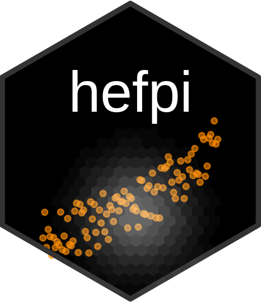
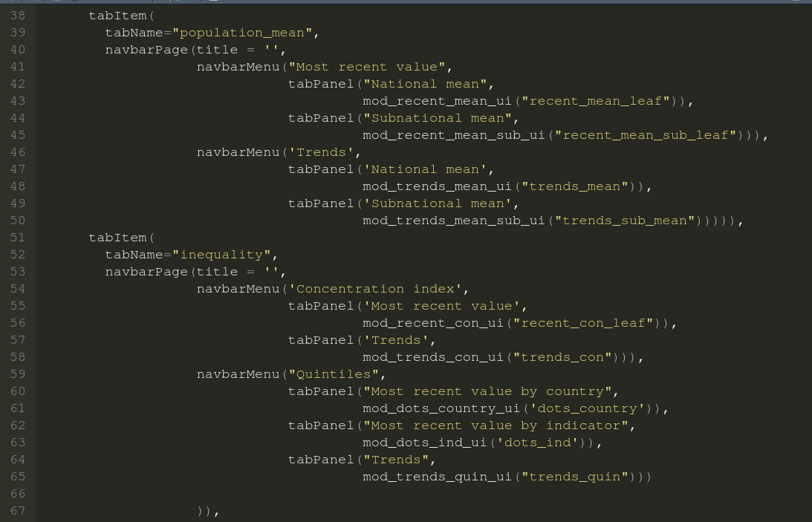
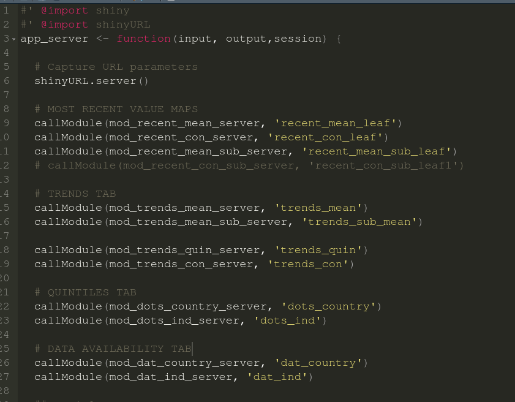

<!-- README.md is generated from README.Rmd. Please edit that file -->

# hefpi <a href='https://github.com/databrew/hepfi'></a>

<!-- badges: start -->

[](https://www.tidyverse.org/lifecycle/#experimental)
<!-- badges: end -->

`hefpi` is a web application for the visual exploration of the World
Bank’s Health Equity and Financial Protection Indicators. It is
currently under active development.

## Installation

You can install hefpi from github by running the following:

``` r
devtools::install_github('databrew/hefpi')
```

## Development

To work on developing this package, you’ll likely want to focus on the
following files:

  - `R/app_server.R`: The server-side code
  - `R/app_ui.R`: The user interface
  - `dev/run_dev.R`: The code you’ll use to run the app locally after
    making changes

## Deploy

To deploy on a shiny server, simply place an `app.R` file in a folder as
one normally would do, and populate that file with the following lines:

``` r
library(hefpi)
run_app()
```

## Reproducing this package

In order to build this package and run the application correctly, one
should:

1.  Clone this repository from the command line: `git clone
    https://github.com/databrew/hefpi`.  
2.  Install the hefpi package in R: `devtools::install_github('databrew/hefpi')`
3.  Run `Rscript dev/run_dev.R` from the command line or in Rstudio.


## The package

The HEFPI dashboard is structured as a R package (created with golem https://cran.r-project.org/web/packages/golem/vignettes/a_start.html)

The primary files:
- `dev/run_dev.R`: The code you'll use to run the app locally after making changes
- `inst/app/www/*`: logos, fonts, and the `custom.css` file that controls the CSS for the app.
- `misc/guide.md`: AWS admin guide for setting up shiny app.
- `data-raw/from_other/*`
- `data-raw/from_wb/*`
- `data-raw/from_website/*`
- `data-raw/raw_data.R`
- `data/*`
- `R/app_config.R`: Used to read insdie golem config file `inst/golem-config.yml`
- `R/app_ui.R`: all ui modules (top level)



- `R/app_server.R`: all server side modules (top level)


- `R/mod_dat.R`: 
  - Data availability by country
  - Data availability by indicator

- `R/mod_trends.R`
  - Trends national mean
  - Trends subnational mean
  - Trends concentration index
  - Trends quintiles
- `R/mod_recent.R` 
  - Most recent value national mean 
  - Most recent value concentration index 
- `R/mod_recent_sub.R`
  - Most recent value subnational mean
- `R/mod_dots.R`
  - Quintiles by country
  - Quintiles by indicator
- `R/plot_theme_new.R`: plot theme function
